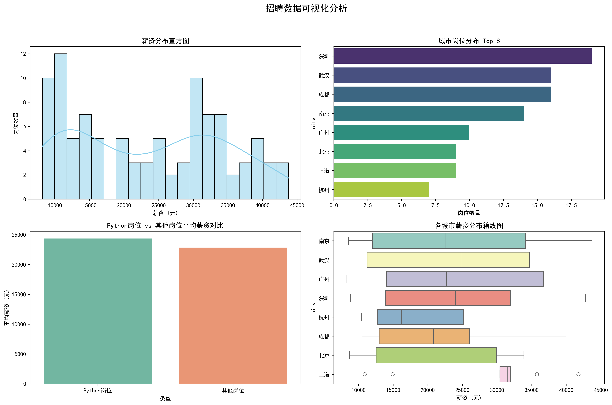

# 招聘数据采集与分析工具
为AI招聘/简历分析产品提供数据支持的爬虫与分析项目。

## 项目背景
为了开发AI简历分析器等产品，需要真实的市场招聘数据。本项目实现了模拟招聘数据的抓取、清洗、统计分析和可视化。

## 核心功能与贡献
- 使用requests抓取招聘数据
- pandas进行数据清洗和统计（薪资、城市、技能分布等）
- matplotlib + seaborn生成4类可视化图表
- 输出结构化数据（CSV、JSON、Excel），可直接用于AI训练或分析

## 产品思考
- 此项目为后续AI招聘产品打下数据基础
- 思考了数据合规性、反爬机制处理
- 下一步计划：接入真实招聘API或大规模数据

## 文件说明
- crawler.py：主程序
- analysis.xlsx / data_cleaned.json：分析结果
- recruitment_analysis.png：可视化报告

## 招聘数据初步分析
已完成模拟招聘数据的抓取、清洗、统计与可视化。

**完成日期**：2026年3月  
**技术栈**：Python、requests、pandas、matplotlib、seaborn

下一步计划：抓取真实招聘网站数据

## 预览

